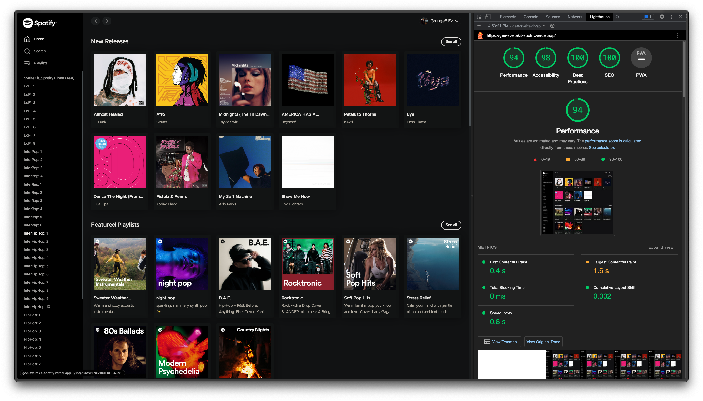
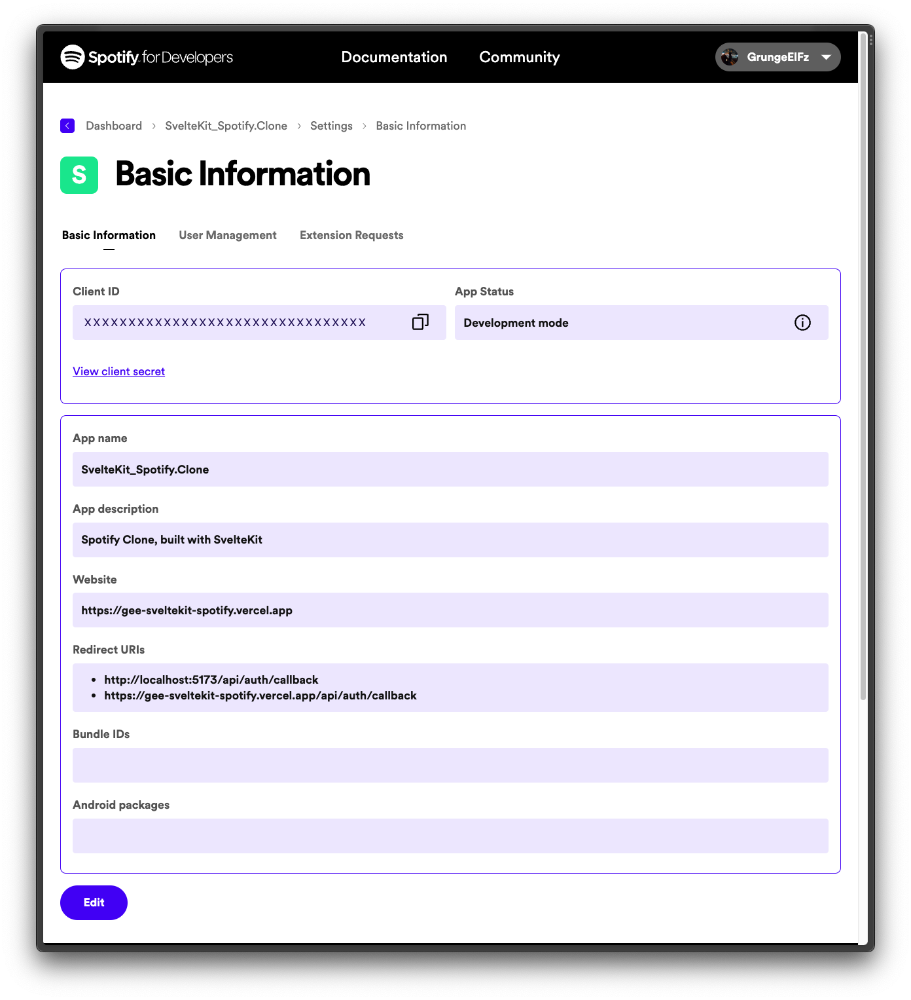

# Spotify Clone, built by SvelteKit

I ❤️ [Svelte](https://kit.svelte.dev/), why don't you? 👀



## Creating a project

#### [Vite](https://kit.svelte.dev/docs/creating-a-project) Initialize

```
npm create svelte@latest SvelteKit_Spotify.Clone

✅ Skeleton project
✅ TypeScript syntax
✅ ESLint for code linting
✅ Prettier for code formatting
✅ Playwright for browser testing
✅ Vitest for unit testing
```

## Adapter

#### [Deployment Configuration](https://kit.svelte.dev/docs/adapter-vercel)

Install with `npm i -D @sveltejs/adapter-vercel` ; then , add the adapter to `svelte.config.js`

```JavaScript
import adapter from '@sveltejs/adapter-vercel';

export default {
    kit: {
        adapter: adapter({
            // Deployment configuration
        })
    }
};
```

## Running Locally

1. Clone this repository :

```bash
> git clone git@github.com:GrungeElFz/SvelteKit_Spotify.Clone.git

> cd SvelteKit_Spotify.Clone

> code .

> npm i

> npm run dev
```

2. Spotify Web API Setup

   > - Log into the [Spotify for Developers - Dashboard](https://developer.spotify.com/dashboard) using your Spotify account.
   > - [Create an app](https://developer.spotify.com/documentation/web-api/concepts/apps). These will be required for API authorization to obtain an access token.
   > - Use the [access token](https://developer.spotify.com/documentation/web-api/concepts/access-token) in your [API requests](https://developer.spotify.com/documentation/web-api/concepts/api-calls).

   > 
   >
   > - ⚠️ Make sure your `http://localhost:xxxx/api/auth/callback` is added into _Redirect URIs_ section.

3. Create `.env` file at the root of your project. The following four environment variables are required :

```ts
SPOTIFY_APP_CLIENT_ID= // xxxxxxxxxxxxxxxxxxxxxxxxxxxxxxxx
SPOTIFY_APP_CLIENT_SECRET= // xxxxxxxxxxxxxxxxxxxxxxxxxxxxxxxx
SPOTIFY_BASE_URL= // https://api.spotify.com/v1
BASE_URL= // http://localhost:xxxx
```

## Project Strucutre

```TS
├── src/
│   ├── app.d.ts
│   ├── app.html
│   ├── assets/
│   │   ├── PFP_01000111.N.png
│   │   ├── Playing.gif
│   │   ├── Spotify_Dashboard-Setup.png
│   │   └── Spotify_White.Logo.png
│   ├── error.html
│   ├── index.test.ts
│   ├── lib/
│   │   ├── actions/
│   │   │   ├── index.ts
│   │   │   └── tippy/
│   │   │       ├── tippy-plugins.ts
│   │   │       └── tippy.ts
│   │   ├── components/
│   │   │   ├── Button.svelte
│   │   │   ├── Card.svelte
│   │   │   ├── Header.svelte
│   │   │   ├── HeaderNav.svelte
│   │   │   ├── IconButton.svelte
│   │   │   ├── ItemPage.svelte
│   │   │   ├── LogoutButton.svelte
│   │   │   ├── Modal.svelte
│   │   │   ├── Navigation.svelte
│   │   │   ├── Pagination.svelte
│   │   │   ├── Player.svelte
│   │   │   ├── PlaylistForm.svelte
│   │   │   ├── SearchForm.svelte
│   │   │   ├── Toasts.svelte
│   │   │   ├── TrackList.svelte
│   │   │   └── index.ts
│   │   ├── helpers/
│   │   │   ├── copyright-symbol.ts
│   │   │   ├── fetch-refresh.ts
│   │   │   ├── index.ts
│   │   │   └── ms-to-time.ts
│   │   └── stores/
│   │       ├── index.ts
│   │       └── toasts.ts
│   ├── params/
│   │   └── list.ts
│   ├── routes/
│   │   ├── [list=list]/
│   │   │   └── [...rest]/
│   │   │       ├── +page.svelte
│   │   │       └── +page.ts
│   │   ├── album/
│   │   │   └── [id]/
│   │   │       ├── +page.svelte
│   │   │       └── +page.ts
│   │   ├── api/
│   │   │   ├── auth/
│   │   │   │   ├── callback/
│   │   │   │   │   └── +server.ts
│   │   │   │   ├── login/
│   │   │   │   │   └── +server.ts
│   │   │   │   ├── logout/
│   │   │   │   │   └── +server.ts
│   │   │   │   └── refresh/
│   │   │   │       └── +server.ts
│   │   │   ├── average-color/
│   │   │   │   └── +server.ts
│   │   │   └── spotify/
│   │   │       └── [...path]/
│   │   │           └── +server.ts
│   │   ├── artist/
│   │   │   └── [id]/
│   │   │       ├── +page.svelte
│   │   │       └── +page.ts
│   │   ├── login/
│   │   │   └── +page.svelte
│   │   ├── playlist/
│   │   │   ├── +page.server.ts
│   │   │   └── [id]/
│   │   │       ├── +page.server.ts
│   │   │       ├── +page.svelte
│   │   │       ├── +page.ts
│   │   │       └── edit
│   │   │           ├── +page.server.ts
│   │   │           ├── +page.svelte
│   │   │           └── +page.ts
│   │   ├── playlists/
│   │   │   ├── +page.svelte
│   │   │   ├── +page.ts
│   │   │   └── new/
│   │   │       ├── +page.server.ts
│   │   │       └── +page.svelte
│   │   ├── profile/
│   │   │   ├── +page.svelte
│   │   │   └── +page.ts
│   │   ├── search/
│   │   │   ├── +page.svelte
│   │   │   ├── +page.ts
│   │   │   └── [query]/
│   │   │       ├── +page.svelte
│   │   │       └── +page.ts
│   │   ├── +error.svelte
│   │   ├── +layout.server.ts
│   │   ├── +layout.svelte
│   │   ├── +layout.ts
│   │   ├── +page.svelte
│   │   └── +page.ts
│   └── styles/
│       ├── _functions.scss
│       ├── main.scss
│       └── tippy-theme.scss
├── static/
│   └── favicon.png
├── tests/
│   └── test.ts
├── .env
├── .eslintrc.cjs
├── .npmrc
├── .prettierrc
├── package-lock.json
├── package.json
├── playwright.config.ts
├── README.md
├── svelte.config.js
├── tsconfig.json
└── vite.config.ts
```

## Spotify Web API

#### [List of Used Scopes :](https://developer.spotify.com/documentation/web-api/concepts/scopes)

##### Images

- `ugc-image-upload`

##### Spotify Connect

- `user-read-playback-state`
- `user-modify-playback-state`
- `user-read-currently-playing`

##### Playback

- `app-remote-control`
- `streaming`

##### Playlists

- `playlist-read-private`
- `playlist-read-collaborative`
- `playlist-modify-private`
- `playlist-modify-public`

##### Follow

- `user-follow-modify`
- `user-follow-read`

##### Listening History

- `user-read-playback-position`
- `user-top-read`
- `user-read-recently-played`

##### Library

- `user-library-modify`
- `user-library-read`

##### Users

- `user-read-email`
- `user-read-private`
